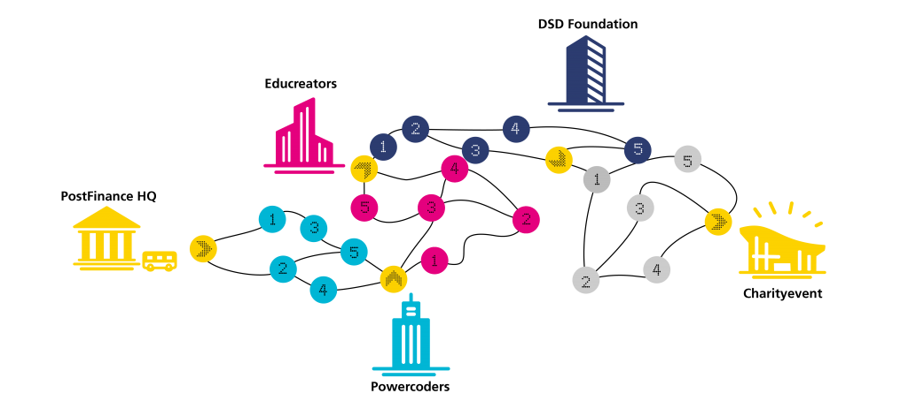

# Pofi IT challenge 2021

## Challenge

Find the shortest path traversing all nodes, starting at the node `pof` and finishing at `cha`.

## Idea

* Split the map into segments. Since all paths pass through the organizations' nodes (yellow), we can split the map there. We end up with 4 segments.
* For each segment, do the following:
  * Find the minimal distance between each pair of nodes, even for pairs not directly connected (see [path.rb](path.rb)). The paths measured may revisit nodes that were already passed.
  * Loop all possible orders of nodes and measure the total distance travelled when visiting them in this order (see [distance.rb](distance.rb)).
  * Take the shortest of those paths.
* Add the distances of each segment.
